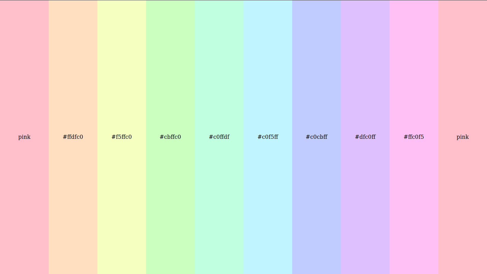

# Feladat

Készíts [Sass](https://sass-lang.com/) stíluslapot a [color-transition.html](color-transition.html) dokumentum az alábbi módon történő
megjelenítéséhez:

A színátmenet a rózsaszíntől kell, hogy induljon, de a kiinduló színt paraméterként kell megadni a stíluslapon, hogy megváltoztatható legyen. Az elrendezés ki kell, hogy töltse az egész böngészőablakot.

A [`sass:color`](https://sass-lang.com/documentation/modules/color) modul [`color.adjust()`](https://sass-lang.com/documentation/modules/color#adjust) függvényét kell használnod a `$hue` argumentummal.
